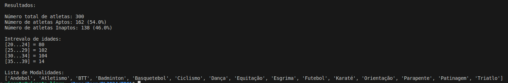

# PL2024

**Título**: Análise de dados em csv

**Autor**: Vicente Costa Martins 

**Número**: A100713

## Objetivos

* Lista ordenada alfabeticamente das modalidades desportivas;
* Percentagens de atletas aptos e inaptos para a prática desportiva;
* Distribuição de atletas por escalão etário (escalão = intervalo de 5 anos): ... [30-34], [35-39], ...

## Resolução:

1. **Leitura dos Dados**: O primeiro passo é ler os dados do arquivo CSV. O arquivo é lido linha por linha, e os dados são armazenados em uma lista.

2. **Contagem de Atletas Aptos e Inaptos**: Durante a leitura dos dados, é feita a contagem de atletas aptos e inaptos. Isso é feito verificando o valor na coluna correspondente em cada linha.

3. **Extração de Modalidades Desportivas**: Também durante a leitura dos dados, todas as modalidades desportivas são extraídas e armazenadas em uma lista. Para evitar duplicatas, verifica-se se a modalidade já está na lista antes de adicioná-la.

4. **Distribuição por Escalão Etário**: Cada atleta é categorizado em um escalão etário com base em sua idade. Os escalões são intervalos de 5 anos, começando em 0-4, 5-9, e assim por diante. Os atletas são contados em cada escalão.

5. **Ordenação e Apresentação dos Resultados**: As modalidades desportivas são ordenadas em ordem alfabética. Os resultados são então apresentados, incluindo o número total de atletas, a porcentagem de atletas aptos e inaptos e a distribuição por escalão etário.

Essa abordagem permite uma análise abrangente dos dados contidos no arquivo CSV, fornecendo insights sobre a composição dos atletas e suas características.

**Solução**:
