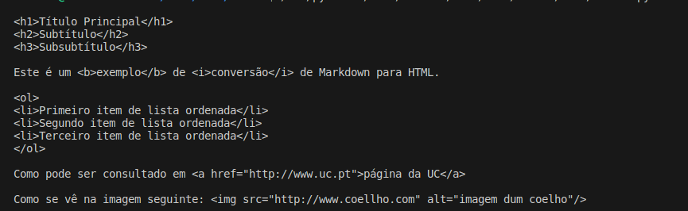

# PL2024

**Título**: Markdown to html

**Autor**: Vicente Costa Martins 

**Número**: A100713

## Objetivos

Criar em Python um pequeno conversor de MarkDown para HTML para os elementos descritos na "Basic Syntax" da Cheat Sheet:

* Cabeçalhos: linhas iniciadas por "# texto", ou "## texto" ou "### texto"
* Bold: pedaços de texto entre "**":
* Itálico: pedaços de texto entre "*":
* Lista numerada:
* Link: [texto](endereço URL)
* Imagem: 

## Resolução:

A resolução é implementada em Python. O programa analisa cada linha do Markdown e converte os elementos especificados em HTML. 

- Para cabeçalhos, identificamos as linhas que começam com um ou mais símbolos "#" e convertemos para as tags HTML de cabeçalho correspondentes.
- O texto em negrito é detectado através dos símbolos "**" e envolto em tags `<b>`.
- Texto em itálico é detectado através dos símbolos "*" e envolto em tags `<i>`.
- Listas numeradas são identificadas pelas linhas que começam com números seguidos de um ponto, e são convertidas em tags HTML de lista ordenada `<ol>` e `<li>`.
- Links são identificados na forma `[texto](URL)` e convertidos em tags `<a>` com o atributo `href`.
- Imagens são identificadas na forma `` e convertidas em tags `` com o atributo `src` para o caminho da imagem e `alt` para o texto alternativo.

**Solução**:

