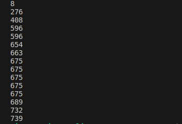

# PL2024

**Título**: Markdown to html

**Autor**: Vicente Costa Martins 

**Número**: A100713

## Objetivos

* Pretende-se um programa que some todas as sequências de dígitos que encontre num texto;
* Sempre que encontrar a string “Off” em qualquer combinação de maiúsculas e minúsculas, esse comportamento é desligado;
* Sempre que encontrar a string “On” em qualquer combinação de maiúsculas e minúsculas, esse comportamento é novamente ligado;
* Sempre que encontrar o caráter “=”, o resultado da soma é colocado na saída.

## Resolução:

1. Leitura do Texto:
O programa lê um texto fornecido como entrada. Este texto pode conter várias linhas com sequências de dígitos e outras palavras, como "On" e "Off", além do caractere "=".

2. Inicialização das Variáveis:
        O programa inicializa duas variáveis: uma para armazenar o total da soma dos dígitos encontrados e outra para controlar se a soma deve ser realizada ou não. Inicialmente, a soma está ligada.

3. Expressão Regular:
        O programa utiliza uma expressão regular para encontrar todas as sequências de dígitos, independentemente de estarem separadas por outros caracteres.

4. Iteração sobre as Linhas:
        Para cada linha do texto, o programa encontra todas as correspondências com a expressão regular.

5. Controle de Soma:
        Se o padrão correspondente for uma sequência de dígitos, o programa adiciona o valor desses dígitos ao total da soma, apenas se o controle de soma estiver ativado.

6. Ativação/Desativação da Soma:
        Se o padrão correspondente for "On", o controle de soma é ativado.
        Se o padrão correspondente for "Off", o controle de soma é desativado.

7. Saída do Resultado:
        Sempre que o programa encontra o caractere "=", ele imprime o total atual da soma na saída.

8. Iteração Completa:
        O programa continua esse processo para todas as linhas do texto fornecido.

**Solução**: 

